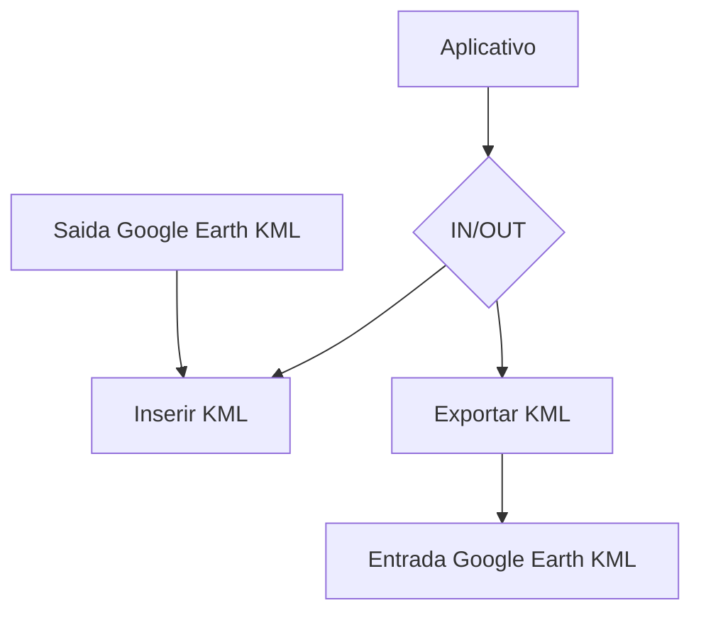

# KML In / KML Out

```mermaid
flowchart TB
    App[Aplicativo] --> Opção{IN/OUT}
    Opção --> IN[Inserir KML]
    Opção --> OUT[Exportar KML]
    KMLIN[Saida Google Earth KML] --> IN
    OUT --> KMLOUT[Entrada Google Earth KML]
```